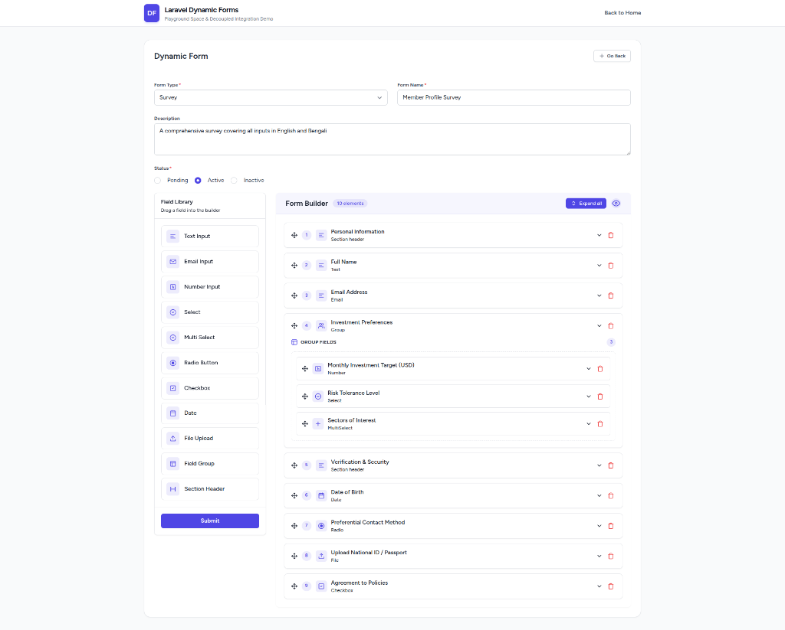
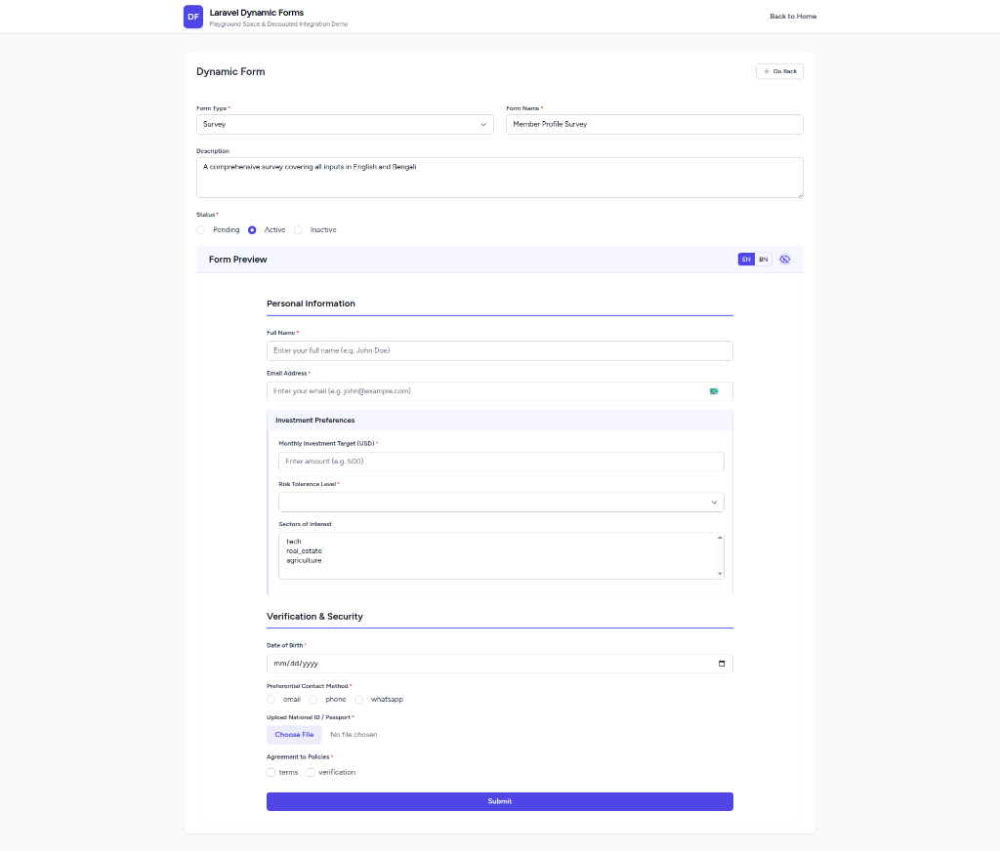

# Laravel Dynamic Forms

A highly decoupled, event-driven, layout-agnostic dynamic form builder package for Laravel and Vue 3.

### Form Builder Interface



### Form Preview Interface



---

## Features

- **Decoupled Architecture**: All UI alerts, page layouts, toast notifications, relationships, and navigation logic are delegated to the host application.
- **Tailwind CSS Ready**: Clean Tailwind markup with a customizable `ldf-*` CSS class prefix namespace.
- **Multiple Locales**: Configuration-driven multi-locale translation inputs (defaults to `en`).
- **Interactive Drag & Drop**: Easy elements library ordering powered by `vuedraggable`.

---

## Installation

### 1. Require the Package via Composer

```bash
composer require muhammadmahedihasan/laravel-dynamic-forms
```

### 2. Run Database Migrations

Run Laravel's migration command to create the package tables (`form_inputs`, `dynamic_forms`, `form_elements`, `form_responses`, `form_response_items`):

```bash
php artisan migrate
```

### 3. Run the Install Command

The install command will publish the package configuration, publish the Vue builder assets into your host application (`resources/js/vendor/dynamic-forms`), inject the `vuedraggable` peer dependency, and seed the default **Form Inputs** catalog into your database:

```bash
php artisan dynamic-forms:install
```

*(Optional)* If you ever need to manually seed or re-seed the default Form Inputs catalog, you can run:

```bash
php artisan db:seed --class="MuhammadMahediHasan\Df\Database\Seeders\FormInputSeeder"
```

### 4. Rebuild Your Assets

Compile the published frontend assets using your asset pipeline (e.g., Vite):

```bash
npm install
npm run build
```

---

## Vue 3 Integration Example

Since the form builder is fully decoupled, you should wrap it inside a page component in your host application. This allows you to wrap the form builder in your main layout, control the button loading states, perform API requests, and show custom toast notifications (e.g., using PrimeVue Toast).

Here is a complete, real-world wrapper component example (`resources/js/pages/YourComponent.vue`):

```vue
<script setup lang="ts">
import { ref } from "vue";
import { Head, router } from "@inertiajs/vue3";
import AppLayout from "@/layouts/AppLayout.vue";

// Import the decoupled form builder component from the vendor resources directory
import FormBuilder from "@/vendor/dynamic-forms/Builder.vue";

interface Props {
  slug?: string;
}

const props = defineProps<Props>();
const isProcessing = ref(false);

const breadcrumbs = [
  { title: "Dashboard", href: "/dashboard" },
  { title: "Forms", href: "/admin/dynamic-form" },
  { title: "Configure Form", href: "/admin/dynamic-form" },
];

// 1. Handle Successful Form Builder Save
const handleSuccess = (savedForm: any) => {
  console.log("Form save successfully", savedForm);
};

// 2. Handle Navigation / Redirection
const handleCancel = () => {
  console.log("Submission is canceled");
};

// 3. Handle Form Builder Errors (e.g. empty element submissions)
const handleError = (message: string) => {
  console.error(message);
};
</script>

<template>
  <Head title="Configure Dynamic Form" />
  <Toast />

  <AppLayout :breadcrumbs="breadcrumbs">
    <template #pageHeader>
      <h2 class="text-xl font-semibold text-gray-800 dark:text-gray-200">
        Configure Form Builder
      </h2>
    </template>

    <!-- Use the Form Builder component and bind the events -->
    <FormBuilder
      :slug="slug"
      @success="handleSuccess"
      @cancel="handleCancel"
      @error="handleError"
    />
  </AppLayout>
</template>
```

---

## Component API

### Props

| Prop        | Type     | Required | Description                                                                                                                      |
| ----------- | -------- | -------- | -------------------------------------------------------------------------------------------------------------------------------- |
| `slug`      | `string` | No       | Pass a slug to put the builder in **Edit Mode** and load an existing form structure. Omit/leave blank to put in **Create Mode**. |
| `apiPrefix` | `string` | No       | API prefix namespace for configuration and inputs (default: `/api/v1/df`).                                                       |

### Events

- **`@success`**: Emits `savedForm` data object when the package successfully saves/updates the form via internal API request.
- **`@cancel`**: Emits when the user triggers the back/go-back button.
- **`@error`**: Emits a `string` validation or network error message.

---

## Custom UI Components (Provide/Inject)

Both the form renderer (`RenderForm.vue`) and the form builder preview support layout-agnostic component overrides. You can inject your own UI components using Vue 3's `provide` API:

```vue
<script setup lang="ts">
import { provide } from "vue";
import CustomInput from "@/components/CustomInput.vue";
import CustomSelect from "@/components/CustomSelect.vue";
import CustomLabel from "@/components/CustomLabel.vue";

// Provide custom components to both builder preview and form renderer
provide("df-components", {
  Input: CustomInput,
  Select: CustomSelect,
  Label: CustomLabel,
});
</script>
```

If these are not provided, the package will automatically fallback to standard fallback HTML components.

---

## Custom Styling

### Tailwind CSS Colors Configuration

The package elements use Tailwind classes that reference a `primary` color palette. To ensure the elements render with correct branding colors, configure your host application's `tailwind.config.js` to define the `primary` colors:

```javascript
// tailwind.config.js
export default {
  theme: {
    extend: {
      colors: {
        primary: {
          DEFAULT: "#4f46e5", // Your main brand color (e.g. indigo-600)
          hover: "#4338ca", // Hover state color (e.g. indigo-700)
        },
      },
    },
  },
};
```

### Namespace Styling overrides

```css
/* Custom styling overrides */
.ldf-card {
  border-color: #3b82f6; /* Custom border color */
  box-shadow: 0 4px 6px -1px rgba(59, 130, 246, 0.1);
}

.ldf-title {
  font-family: "Outfit", sans-serif;
  letter-spacing: -0.025em;
}

.ldf-back-btn {
  border-radius: 9999px;
  background-color: #f3f4f6;
}
```

---

## License

The MIT License (MIT). Please see [License File](LICENSE.md) for more information.
